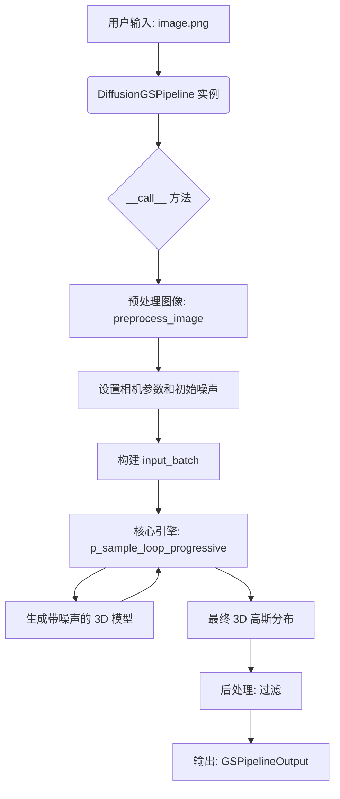

# pipline_obj.py 源码解析

`pipline_obj.py` 是 DiffusionGS 项目中用于**物体为中心**的图像到 3D 模型生成的核心管道文件。它定义了 `DiffusionGSPipeline` 类，该类封装了从加载预训练模型到预处理输入图像，再到执行扩散模型推理和后处理生成结果的整个流程。可以说，它是连接用户输入和核心扩散模型的桥梁。

## 核心类与功能

### `DiffusionGSPipeline` 类

这是管道的核心类，负责管理整个 3D 对象生成流程。

#### `from_pretrained(cls, pretrained_model_name_or_path, **kwargs)`

*   **功能**: 这是一个类方法，也是使用预训练模型最便捷的入口。它负责从 Hugging Face Hub 或本地路径下载并加载预训练的模型权重、配置文件和相机模板。
*   **名词**:
    *   `pretrained_model_name_or_path`: 预训练模型的名称或路径。
    *   `ckpt_path`: 模型权重文件路径。
    *   `config_path`: 配置文件路径。
    *   `cam_template_path`: 相机模板路径。
    *   `system`: 核心的 `DiffusionGSSystem` 对象。
*   **动词**:
    *   `hf_hub_download`: 从 Hugging Face Hub 下载文件。
    *   `load_config`: 加载配置文件。
    *   `find`: 根据配置查找并创建 `system` 对象。
    *   `load_state_dict`: 加载模型权重。
*   **引擎**: `system = diffusionGS.find(cfg.system_type)(cfg.system)` 这行代码是引擎的点火部分，它根据配置创建了核心的 `system` 实例。
*   **调用图**:
    ```
    from_pretrained
        -> hf_hub_download (下载模型、配置、相机模板)
        -> load_config (加载配置)
        -> diffusionGS.find (查找并创建 system)
        -> system.load_state_dict (加载模型权重)
        -> return cls(device, cfg, system) (返回 pipeline 实例)
    ```

#### `preprocess_image(self, images_pil, ...)`

*   **功能**: 负责预处理输入图像。主要包括**移除背景**、**裁剪**和**填充**，以确保输入图像是符合模型要求的正方形、白底、主体居中的图像。
*   **核心依赖**: `rembg` 库用于移除背景。
*   **动词**:
    *   `rembg.remove`: 移除图像背景。
    *   `image.split`: 分离图像通道。
    *   `alpha.getbbox`: 获取非透明区域的边界框。
    *   `image.crop`: 裁剪图像。
    *   `image.resize`: 调整图像大小。
    *   `PIL.Image.new`: 创建新图像。
    *   `image.paste`: 粘贴图像。

#### `__call__(self, image, ...)`

*   **功能**: 这是管道的**核心执行方法**，当 `DiffusionGSPipeline` 对象被调用时，此方法会被执行。它完整地执行了从图像输入到 3D 高斯分布输出的全过程。
*   **点火钥匙**: 调用 `DiffusionGSPipeline` 实例，例如 `pipeline("image.png")`。
*   **引擎**: `self.system.diffusion_inference.p_sample_loop_progressive(...)` 是整个生成过程的核心引擎，它执行了扩散模型的反向采样过程，从噪声中逐步生成 3D 模型。
*   **流程**:
    1.  **输入检查**: 检查输入图像的有效性。
    2.  **图像预处理**: 调用 `preprocess_image` 方法处理图像。
    3.  **推理 (Inference)**:
        *   设置相机参数（位姿 `c2w` 和内参 `fxfycxcys`）。
        *   生成初始随机噪声 `sample_noise`。
        *   构建 `input_batch`，包含图像、相机参数、噪声等信息。
        *   **调用 `self.system.diffusion_inference.p_sample_loop_progressive` 执行核心的扩散去噪循环。**
    4.  **后处理**:
        *   从去噪结果中提取预测的 3D 高斯分布 (`pred_gaussians`) 和渲染图像 (`render_images`)。
        *   对高斯分布进行过滤，例如去除透明度过低的“点”。
    5.  **输出**: 返回包含最终 3D 高斯分布和渲染图像的 `GSPipelineOutput` 对象。

## 总结

`pipline_obj.py` 文件定义了一个高级、易于使用的接口，将复杂的 3D 生成过程封装在一个简单的 `DiffusionGSPipeline` 类中。开发者可以通过 `from_pretrained` 方法轻松加载预训练模型，然后像调用一个普通函数一样调用 pipeline 实例来生成 3D 模型。

**核心流程可以概括为**:



这个文件是理解 DiffusionGS 项目如何实现**从单张图片生成 3D 物体**的最佳起点。它的实现清晰地展示了各个模块（如 `system`, `diffusion_inference`, `shape_model`）是如何协同工作的。
